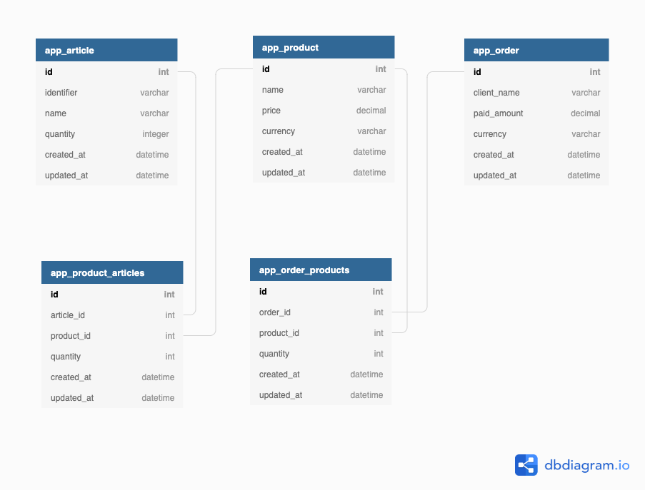

## Warehouse

Warehouse Management Software.

[](https://travis-ci.com/bitbucket/Clivern/warehouse)


Warehouse is A RESTful web service built with `Python` (`Django` Framework), it uses `MySQL` or `SQLite` as a datastore. The following endpoints got implemented:

- `POST: /api/v1/load/articles`: Load articles from a JSON into the database
- `POST: /api/v1/load/products`: Load products from a JSON into the database
- `GET: /api/v1/product?limit=<limit>&offset=<offset>`: Get products list
- `GET: /api/v1/product/<product_id>`: Get product with id
- `POST: /api/v1/order`: Create a new order, Multi products per order supported
- `GET: /api/v1/order/<order_id>`: Get order by id
- `GET: /_health`: For application health monitoring.


### Getting Started

Clone the project and then create a python environment:

```
$ git clone https://Clivern@bitbucket.org/Clivern/warehouse.git
$ cd warehouse

# This may change based on your local python setup
$ python3 -m venv venv
$ source venv/bin/activate
```

Create `.env` from `.env.example` and update DB credentials. You can use `mysql` or `sqlite`.

```
$ cp .env.example .env
```

```
DB_CONNECTION=mysql
DB_HOST=127.0.0.1
DB_PORT=3306
DB_DATABASE=warehouse
DB_USERNAME=root
DB_PASSWORD=root

// OR

DB_CONNECTION=sqlite
DB_HOST=127.0.0.1
DB_PORT=3306
DB_DATABASE=warehouse
DB_USERNAME=root
DB_PASSWORD=root
```

Install dependencies (the mandatory ones and the ones required for the sanity check `make ci`).

```
$ make config
```

Migrate database

```
$ make migrate
```

Then run the application

```
$ make run
```

Define the warehouse URL, it will used through all steps afterwards

```
$ export BASE_URL=http://127.0.0.1:8000
```

To get application health

```
$ curl -X GET "$BASE_URL/_health" -s | jq .
```

To load articles from a JSON file (`assignment/inventory.json`). Make sure you are inside `warehouse` folder

```
$ curl -X POST -H "Content-Type: application/json" -d @assignment/inventory.json $BASE_URL/api/v1/load/articles -v
```

To load products from a JSON file (`assignment/products.json`)

```
$ curl -X POST -H "Content-Type: application/json" -d @assignment/products.json $BASE_URL/api/v1/load/products -v
```

To get products list

```
$ curl -X GET "$BASE_URL/api/v1/product?offset=0&limit=10" | jq .

{
  "products": [
    {
      "id": 2,
      "name": "Dinning Table",
      "price": {
        "amount": "20.00",
        "currency": "EUR"
      },
      "createdAt": "2020-11-08T14:15:07.794Z",
      "updatedAt": "2020-11-08T14:15:07.794Z",
      "quantity": 1
    },
    {
      "id": 1,
      "name": "Dining Chair",
      "price": {
        "amount": "20.00",
        "currency": "EUR"
      },
      "createdAt": "2020-11-08T14:15:07.781Z",
      "updatedAt": "2020-11-08T14:15:07.781Z",
      "quantity": 2
    }
  ],
  "metadata": {
    "offset": 0,
    "limit": 10,
    "total": 2
  }
}
```

To get product with `id`. for example with `id = 1`

```
$ curl -X GET "$BASE_URL/api/v1/product/1" | jq .

{
  "id": 1,
  "name": "Dining Chair",
  "price": {
    "amount": "20.00",
    "currency": "EUR"
  },
  "createdAt": "2020-11-08T14:15:07.781Z",
  "updatedAt": "2020-11-08T14:15:07.781Z",
  "quantity": 2
}
```

To create an order. it will remove product(s) and update inventory

```
# It will fail, since stock won't allow that amount
$ curl -X POST -H "Content-Type: application/json" \
    -d '{"client": {"name": "clivern"}, "products": [{"id": 1, "quantity": 2},{"id": 2, "quantity": 1}]}' \
    $BASE_URL/api/v1/order

{
  "errorCode": "APP0001",
  "errorMessage": "Sorry! Some of the ordered products are out of stock",
  "correlationId": "18be14f0-1795-4f5d-b69b-f10c3efdfeb8",
  "reference": "https://developer.ikea.com/errors/APP0001"
}

# This should succeed, since stock allow
$ curl -X POST -H "Content-Type: application/json" \
    -d '{"client": {"name": "clivern"}, "products": [{"id": 1, "quantity": 1},{"id": 2, "quantity": 1}]}' \
    $BASE_URL/api/v1/order

{
   "client":{
      "name":"clivern"
   },
   "payment":{
      "amount":"40.00",
      "currency":"EUR"
   },
   "createdAt":"2020-11-08T14:36:01.453Z",
   "updatedAt":"2020-11-08T14:36:01.453Z",
   "products":[
      {
         "id":1,
         "name":"Dining Chair"
      },
      {
         "id":2,
         "name":"Dinning Table"
      }
   ]
}

# If you check products again, quantity should be zero for both products
$ curl -X GET "$BASE_URL/api/v1/product?offset=0&limit=10" | jq .

{
  "products": [
    {
      "id": 2,
      "name": "Dinning Table",
      "price": {
        "amount": "20.00",
        "currency": "EUR"
      },
      "createdAt": "2020-11-08T14:35:29.467Z",
      "updatedAt": "2020-11-08T14:35:29.467Z",
      "quantity": 0
    },
    {
      "id": 1,
      "name": "Dining Chair",
      "price": {
        "amount": "20.00",
        "currency": "EUR"
      },
      "createdAt": "2020-11-08T14:35:29.458Z",
      "updatedAt": "2020-11-08T14:35:29.458Z",
      "quantity": 0
    }
  ],
  "metadata": {
    "offset": 0,
    "limit": 10,
    "total": 2
  }
}
```

To get order with `id`. for example with `id = 1`

```
$ curl -X GET "$BASE_URL/api/v1/order/1" | jq .

{
  "client": {
    "name": "clivern"
  },
  "payment": {
    "amount": "40.00",
    "currency": "EUR"
  },
  "createdAt": "2020-11-08T15:06:01.793Z",
  "updatedAt": "2020-11-08T15:06:01.793Z",
  "products": [
    {
      "id": 1,
      "name": "Dining Chair",
      "quantity": 1
    },
    {
      "id": 2,
      "name": "Dinning Table",
      "quantity": 1
    }
  ]
}
```


### Database Schema



### Development

Create a python virtual environment:

```
$ python3 -m venv venv
$ source venv/bin/activate

# To Quit
$ deactivate
```

Install required dependencies

```
$ make config
```

Create a config file, then update `.env` file with database credentials

```
$ make create-env
```

Migrate database

```
$ make migrate
```

To run the application

```
$ make run
```

To run quality checks (linting, testing ... etc)

```
$ make ci
```


### Deployment

### With docker-compose

Create a config file and then lauch the container:

```
$ apt-get update
$ sudo apt install docker.io
$ sudo systemctl enable docker
$ sudo apt install docker-compose

$ git clone https://Clivern@bitbucket.org/Clivern/warehouse.git
$ cd warehouse

# Create config file
$ cp .env.example .env

# Tear up
$ docker-compose up -d

# Tear down
$ docker-compose down

# Check containers
$ docker ps
```

All containers have a health check running, in order to check the health check status for a certain container:

```
$ docker inspect --format "{{json .State.Health }}" <CONTAINER_ID> | jq .
```

We mount local volumes to all containers to store some data (logs and database files for mysql). To list these volumes:

```
$ docker volume ls
local               warehouse_app_logs
local               warehouse_db_data
local               warehouse_nginx_logs

# To watch server logs (debugging purposes)
$ tail -f /var/lib/docker/volumes/warehouse_nginx_logs/_data/*

# To watch application logs (debugging purposes)
$ tail -f /var/lib/docker/volumes/warehouse_app_logs/_data/logs/*
```


### On Ubuntu

- You will need to install python, venv, gunicorn, nginx and mysql.
- Create a systemd service file for gunicorn so you can start and stop the application.
- Configure Nginx to proxy pass to gunicorn.
- We can build ansible playbook or chef cookbook to automate these steps.


### License

© 2020, Warehouse. Released under [Apache License, Version 2.0](https://www.apache.org/licenses/LICENSE-2.0).

**Warehouse** is authored and maintained by [@clivern](https://bitbucket.org/Clivern/warehouse).
